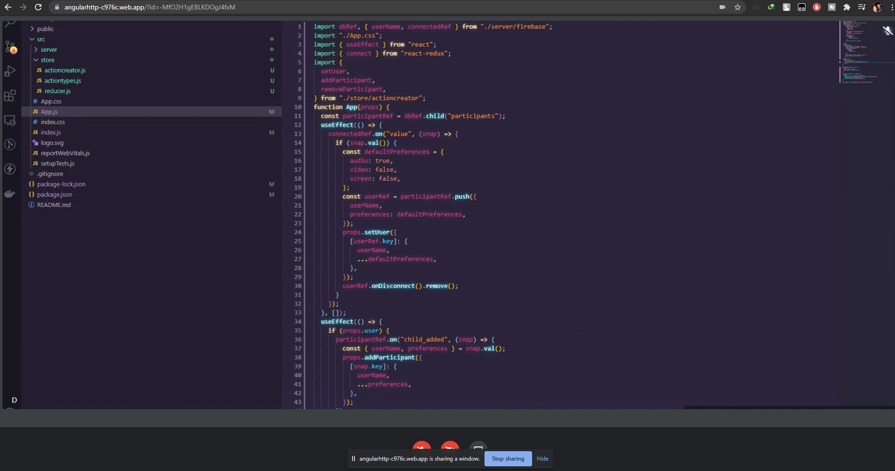

# 구미 특화 2반 3팀 간장공장공장장 (작성중)

 
  <h3 align="center">간장공장공장장</h3>

  

       
     어색한 분위기를 아이스브레이킹하기 위한 돕는 서비스
     
  

<!-- 주 기술 스택 -->
## 주 기술 스택

* [React]
* [Firebase]
* [Kospeech]

<!-- 주요기능 -->
## 주요기능

### 1. 닉네임 설정

* 대기실 참여하기 전 유저 닉네임 설정과 카메라, 마이크 설정을 할 수 있다.

### 2. 대기실 생성

#### 게임모드 설정

1. 조준영 모드

* 문장이 주어진다.

* 버튼을 눌러 문장을 녹음한다.

* 녹음본을 텍스트로 변환해서 체크

* 정답률을 넘었는지 체크, 타이머는 시작버튼을 누르고부터 돌고, 종료 버튼 클릭 시 타이머도 종료.

* 걸린 시간 체크

* 정답률을 넘긴 것 중에서 시간순으로 순위 지정

* 미리 정한 라운드(3,5,7) 수 만큼 누적 시간을 매겨 순위 지정

2. 윤승일 모드

* 사용하지 않았던 문장 중에서 랜덤하게 문장이 주어진다.

* 버튼을 눌러 문장을 녹음한다.

* 녹음본을 텍스트로 변환

* 정답률을 넘었는 지와 문장 별로 지정된 제한시간 내에 마쳤는지 확인

* 위의 조건을 만족하면 해당 플레이어는 생존. 만족하지 못한 경우 사망

* 생존자 인원수 체크 

> 몰살엔딩, “정말 못하시네요” 메시지 출력 후 게임 종료

> 1명 : 승리엔딩, 승자얼굴 클로즈업 후 게임종료

> 2명이상 : 다음라운드 진행, 모든 문장의 제한시간을 n초 줄인다 (단, 최소시간 밑으로는 불가능)

#### 최대 인원수 설정

#### 대기실 제목 설정

### 3. 대기실 참가

* 대기실 목록에서 입장하기

* 대기실 코드를 통해 입장하기

> 대기실을 생성하게 되면 자동으로 만들어지는 코드 값을 친구에게 보내 입장

### 4. 대기실 나가기

### 5. 게임 준비 및 시작
 
## 테스트 화면 (WebRTC)

* Desktop View

* Desktop Sharing View

* Mobile View
 

